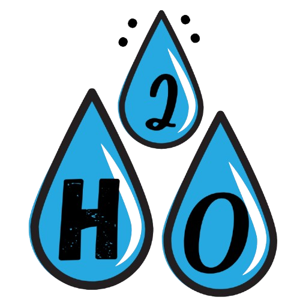

 

# 🌍 H2O Alert - Water Crisis Tracker

**H2O Alert** is a web-based platform designed to visualize and track water crises globally and across India. It provides real-time insights into water shortages, helping users stay informed and take action.

## 🚀 Features
- 🌎 **Global Heat Map Tracker** – Visualizes water crises worldwide
- 🇮🇳 **India Heat Map Tracker** – Focuses on national water issues
- 📢 **Feedback Page** – Users can report water-related problems
- 📖 **About Page** – Provides details on data sources and project info
- 💧 **Water Conservation Section** – Tips & strategies for saving water

## 🛠️ Tech Stack
- **Frontend:** HTML, CSS, JavaScript
- **Backend:** PHP & SQL (Using XAMPP)
- **Visualization:** Free heat map solutions
- 
---
🌊 *Together, we can make a difference!*
